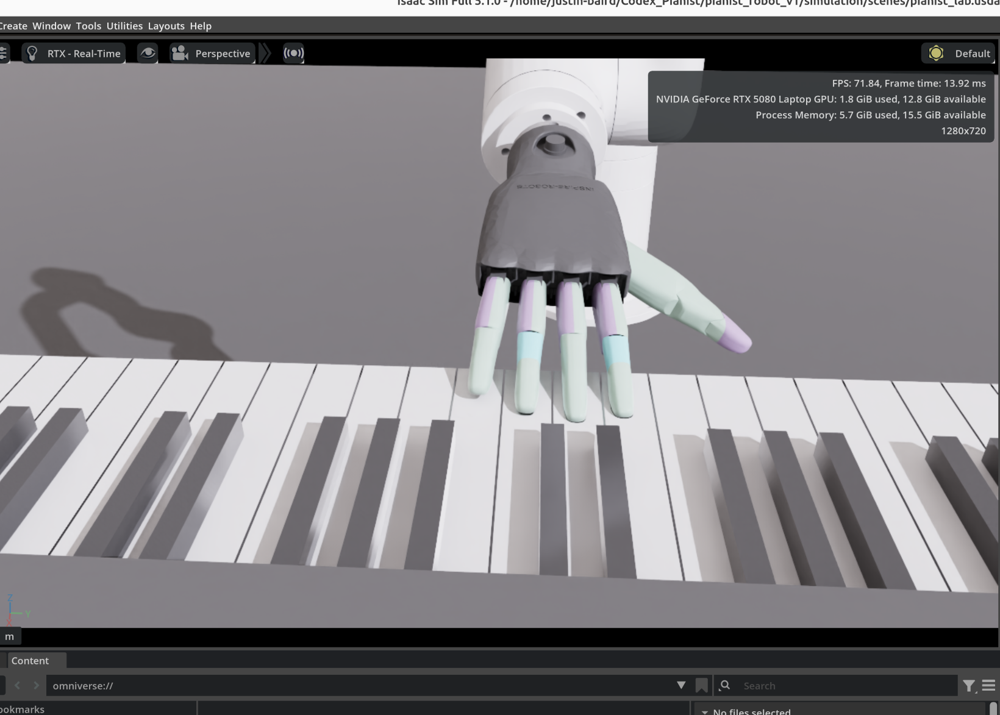

# Codex Pianist

Codex Pianist is a robotic piano project built around:

- a UFactory `UF850` arm
- an `Inspire RH56DFX-2R` robotic hand
- a custom 3D-printed adapter that mounts the hand to the arm
- an Isaac Sim / Isaac Lab simulation workflow for assembly, scene validation, and reinforcement-learning preparation
- a direct hardware-control workflow for simple scripted arm and hand motion outside the simulator

This repository contains the first working public snapshot of that system.

## Built In Codex

This repository was built end-to-end through iterative engineering work in Codex.

That includes:

- direct hardware-control scripts for the arm and hand
- URDF preprocessing and conversion flow for Isaac
- STL import and scaling for the printed adapter
- assembly generation for arm + adapter + hand
- Isaac GUI launch tooling
- scene setup for the piano lab environment
- export packaging for a minimal hardware-only bundle
- repository preparation for public release

This is not a manually curated example repo that was later summarized in AI. The implementation work itself was done through Codex-driven development.

## Codex-Driven Reward Evolution

Our project utilizes a Recursive Reward Loop. We provided Codex with the URDF joint maps and the MIDI target. Codex generated the mdp/rewards.py logic, which was then iterated upon by feeding simulation 'failure logs' back into the model. This allowed for Zero-Shot Finger Isolation (Tucked Thumb/Pinky) which is notoriously difficult to achieve with manual heuristic tuning.

## Version

- Current repository snapshot: `v1.0.0`
- Simulation version marker: [pianist_robot_v1/simulation/VERSION](pianist_robot_v1/simulation/VERSION)
- Frozen simulation date: `2026-02-27`
- Current post-`v1.0.0` simulation milestone: `Isaac Sim alignment ready`

Version `1.0.0` captures the first assembled simulation with:

- UF850 arm
- Inspire RH56DFX-2R hand
- custom printed hand adapter
- working Isaac scene launch
- working direct arm/hand command scripts

The current simulation branch state goes beyond that initial snapshot. The Isaac scene has now been aligned so that:

- the RoboPianist keyboard is in the scene
- the keyboard orientation matches the robot-facing setup
- the Inspire hand clocking matches the physical adapter/bolt alignment
- the center arm pose matches the real-world joint values
- the piano position is aligned so the index finger is positioned over middle C
- the finger contact lands on the white keys instead of the black keys

## Isaac Sim Alignment Ready

The current simulator milestone is `Isaac Sim alignment ready`.

This means the public repo now contains a visually aligned Isaac scene that is suitable as the starting point for reinforcement-learning work and further task/environment definition.

The aligned scene currently includes:

- `UF850` arm positioned at the calibrated center pose
- `Inspire RH56DFX-2R` hand clocked to match the real-world mounting orientation
- printed adapter integrated into the assembly
- RoboPianist keyboard placed and aligned relative to the hand
- Isaac launch tooling that opens directly into the inspection scene and applies the center pose automatically

Reference screenshot from the aligned Isaac scene:



## What Is In This Repo

The repository currently has two main tracks.

### 1. Full Project

[pianist_robot_v1](pianist_robot_v1) contains:

- direct hardware control for the real arm and hand
- arm calibration and note-test routines
- simulation asset conversion scripts
- generated USD and URDF outputs
- assembled Isaac scene files
- piano-lab simulation environment used as the starting point for RL work

### 2. Portable Hardware Export

[Export_Codex_Pianist](Export_Codex_Pianist) contains:

- only the files needed to connect to and command the real arm and hand
- no simulation assets
- no Isaac setup
- no modeling pipeline

That folder is intended for moving simple hardware control to another machine quickly.

## Hardware Stack

The current physical system uses:

- `UFactory UF850` arm
- `Inspire RH56DFX-2R` hand
- RS485 / Modbus RTU hand communication
- Ethernet arm communication
- custom `Inspire-adapter.stl` printed adapter for mechanical mounting

## Software Stack

The current project uses:

- Python
- `xarm-python-sdk` for arm control
- `minimalmodbus` and `pyserial` for hand control
- NVIDIA Isaac Sim
- Isaac Lab tooling for URDF to USD conversion workflows
- USD / USDA assets for robot assembly and scene composition
- imported upstream robot-description sources as pinned submodules

## Simulation Stack

The simulation path is centered in [pianist_robot_v1/simulation](pianist_robot_v1/simulation).

Key outputs in the current simulation state:

- [uf850.usd](pianist_robot_v1/simulation/uf850.usd)
- [inspire_rh56dfx_2r_hand.usd](pianist_robot_v1/simulation/inspire_rh56dfx_2r_hand.usd)
- [assets/adapter/Inspire-adapter.usda](pianist_robot_v1/simulation/assets/adapter/Inspire-adapter.usda)
- [assets/keyboard/robopianist_keyboard.usda](pianist_robot_v1/simulation/assets/keyboard/robopianist_keyboard.usda)
- [pianist_robot.usda](pianist_robot_v1/simulation/pianist_robot.usda)
- [scenes/pianist_lab.usda](pianist_robot_v1/simulation/scenes/pianist_lab.usda)
- [open_stage_center_pose_on_startup.py](pianist_robot_v1/simulation/open_stage_center_pose_on_startup.py)
- [run_isaac_gui_center_pose.sh](pianist_robot_v1/simulation/run_isaac_gui_center_pose.sh)

The assembled scene includes:

- the UF850 arm
- the Inspire hand
- the custom adapter
- a ground plane
- the RoboPianist keyboard
- calibrated scene alignment for arm, hand, and keyboard inspection

Detailed simulation notes are in [pianist_robot_v1/simulation/README.md](pianist_robot_v1/simulation/README.md).

## Direct Hardware Control

The direct-control path is implemented with these scripts:

- [check_hardware.py](pianist_robot_v1/check_hardware.py)
- [startup_test.py](pianist_robot_v1/startup_test.py)
- [four_finger_note_test.py](pianist_robot_v1/four_finger_note_test.py)
- [continuous_practice.py](pianist_robot_v1/continuous_practice.py)
- [play_center_calibration.py](pianist_robot_v1/play_center_calibration.py)
- [main.py](pianist_robot_v1/main.py)

Supporting modules:

- [drivers/xarm_driver.py](pianist_robot_v1/drivers/xarm_driver.py)
- [drivers/hand_modbus_driver.py](pianist_robot_v1/drivers/hand_modbus_driver.py)
- [intelligence/piano_logic.py](pianist_robot_v1/intelligence/piano_logic.py)

## Upstream Sources

This repository uses submodules for external source dependencies under `pianist_robot_v1/simulation/sources`:

- `IsaacLab`
- `dex-urdf`
- `xarm_ros2`

These are pinned to the exact commits used for `v1.0.0`.

Clone with submodules:

```bash
git clone --recurse-submodules https://github.com/justinbairdtesseract/Codex_Pianist.git
```

Or, after clone:

```bash
git submodule update --init --recursive
```

## Quick Start

### Hardware-Only Export

If you only want to move the real arm and hand from another machine, use:

- [Export_Codex_Pianist](Export_Codex_Pianist)

That bundle has its own [README.md](Export_Codex_Pianist/README.md).

### Isaac Simulation

From the main project:

```bash
cd pianist_robot_v1
source .venv_isaac/bin/activate
./simulation/run_isaac_gui.sh simulation/scenes/pianist_lab.usda
```

For the aligned inspection scene and calibrated center pose:

```bash
cd pianist_robot_v1
source .venv_isaac/bin/activate
./simulation/run_isaac_gui_center_pose.sh simulation/scenes/pianist_lab.usda
```

### Direct Hardware Sanity Check

```bash
cd pianist_robot_v1
source .venv/bin/activate
python check_hardware.py --show-all-usb-serial
python startup_test.py --hand-port auto
```

## Current Status

At the current repository state, the project has:

- working hardware-control scripts
- a working assembled simulation
- an aligned Isaac Sim piano scene ready for RL setup
- working GUI launch into Isaac
- a portable direct-control export
- a clean public repository baseline for hackathon development

The next major phase is reinforcement learning on top of the Isaac simulation environment.

## Repository Notes

- Local Isaac virtual environments are intentionally excluded from Git.
- The repo keeps generated assembly assets that are part of the working `v1.0.0` snapshot.
- Upstream robot-description dependencies are tracked as submodules rather than copied vendor trees.

## License / Attribution

This repository includes original project code plus references to upstream open-source dependencies through submodules.

Please review the licenses in the upstream projects for:

- `IsaacLab`
- `dex-urdf`
- `xarm_ros2`
